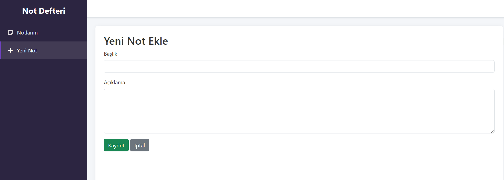

# Not Defteri MVC Uygulaması

C# ASP.NET Core MVC not defteri uygulamasıdır. Tüm veriler JSON formatında saklanır.

## Özellikler

*   **JSON Veri Saklama**: Tüm notlar `notlar.json` dosyasında tutulur.
*   **Kolay Kurulum**: Projeyi indirip hemen çalıştırabilirsiniz.
*   **MVC Yapısı**: Modern ASP.NET Core MVC desenlerine uygun geliştirilmiştir.
*   **CRUD İşlemleri**: Not ekleme, düzenleme, silme ve listeleme özellikleri.

## Teknolojiler

*   **Framework**: .NET 8.0 (ASP.NET Core MVC)
*   **Dil**: C#
*   **Önyüz**: HTML5, CSS3, JavaScript (Bootstrap ile)
*   **Veri**: JSON

## Kurulum ve Çalıştırma

### Visual Studio ile
1.  `Not Defteri` klasörünü Visual Studio 2022+ ile açın.
2.  `NotDefteriMvc.csproj` projesine sağ tıklayıp **Başlangıç Projesi Olarak Ayarla** (Set as Startup Project) seçeneğini işaretleyin.
3.  **F5** veya **Ctrl+F5** tuşuna basarak uygulamayı başlatın.

## Proje Yapısı

*   **Controllers/**: `NotesController` gibi not işlemlerini yöneten denetleyiciler.
*   **Models/**: `Note` gibi veri yapılarını tanımlayan sınıflar.
*   **Services/**: `JsonNoteRepository` gibi veri okuma/yazma işlemlerini yapan servisler.
*   **Views/**: Kullanıcı arayüzünü oluşturan `.cshtml` dosyaları.
*   **wwwroot/**: CSS, JavaScript ve resim gibi statik dosyalar.

